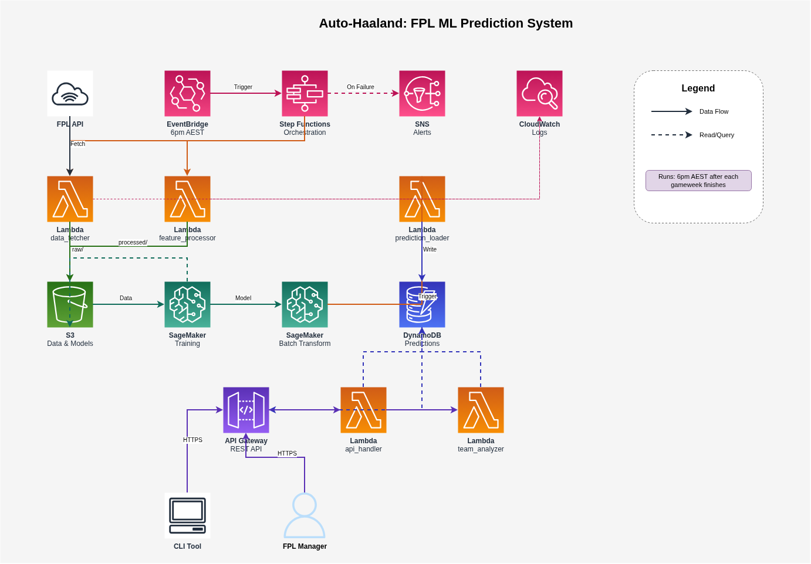

# Auto-Haaland: FPL ML Prediction System


An automated Fantasy Premier League prediction system using XGBoost and AWS.

## Purpose
 - Play around with AWS and its ML services

## Features

- Fetches live FPL data via API with rate limiting
- Lambda-based data pipeline for processing player statistics
- XGBoost model training on SageMaker
- Batch predictions stored in DynamoDB
- REST API for retrieving predictions
- Full local development environment with LocalStack

## Quick Start

### Setup

```bash
# Automated setup (requires sudo)
./setup.sh

# Or manual setup
sudo apt install python3.12-venv docker-compose
python3 -m venv venv
source venv/bin/activate
pip install -r requirements-dev.txt
```

### Testing

```bash
# Test with real FPL API
source venv/bin/activate
python scripts/test_real_fpl_api.py

# Run all tests
make test

# Run specific test suites
make test-unit          # Unit tests (fast)
make test-integration   # Integration tests (with LocalStack)
```

### Local Development

```bash
make local-up    # Start LocalStack (S3, DynamoDB)
make local-down  # Stop LocalStack
make local-logs  # View logs
make help        # See all commands
```

LocalStack runs at:
- S3: `http://localhost:4566`
- DynamoDB Admin UI: `http://localhost:8001`

## Architecture



See [fpl-ml-aws-architecture.md](./fpl-ml-aws-architecture.md) for details.

## Project Structure

```
auto-haaland/
├── lambdas/
│   ├── common/              # FPL API client, AWS utilities
│   └── data_fetcher/        # Lambda handler for data fetching
├── tests/
│   ├── unit/                # 18 unit tests
│   └── integration/         # 5 integration tests
├── scripts/
│   └── test_real_fpl_api.py # Real API verification
├── docker-compose.yml       # LocalStack configuration
├── Makefile                 # Development commands
└── setup.sh                 # Automated setup
```

## Data Storage

```
s3://fpl-ml-data/raw/season_YYYY_YY/
├── gwN_bootstrap.json       # Players, teams, gameweeks
├── gwN_fixtures.json        # Fixtures for gameweek N
└── gwN_players/
    └── player_*.json        # Individual player histories
```

## Technology Stack

- Python 3.12
- AWS: Lambda, S3, DynamoDB, SageMaker, Step Functions
- XGBoost for predictions
- LocalStack for local AWS emulation
- pytest + moto for testing

## Testing

- 60% Unit Tests (fast, no dependencies)
- 30% Integration Tests (LocalStack/moto)
- 10% E2E Tests (real AWS, minimal)


## Cost Estimate

- **Development**: ~$3-6
- **Production**: (~$0.60/gameweek)
